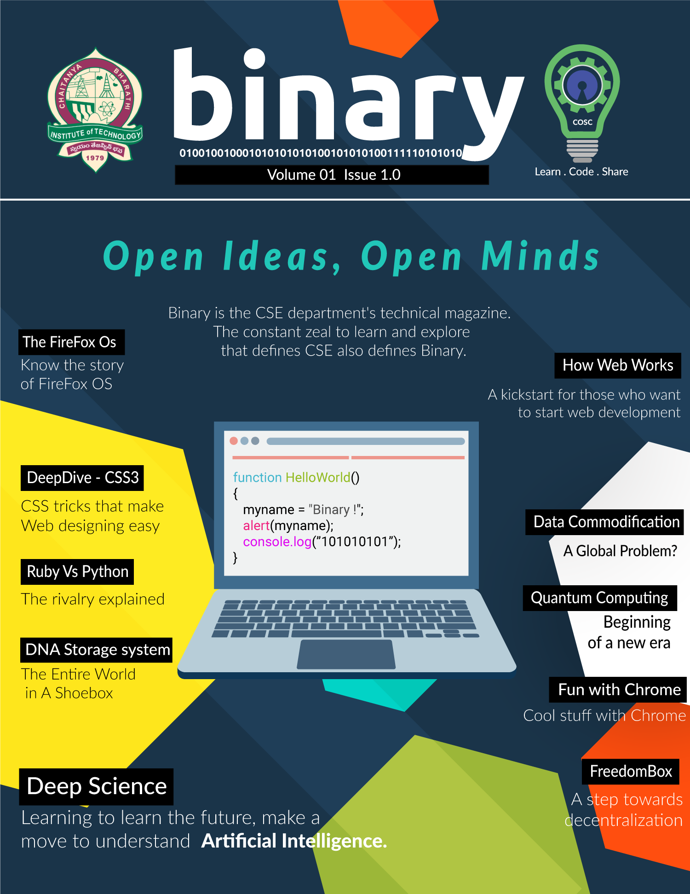

# Binary 2017

Binary is CBIT CSE's technical magazine.The constant zeal to learn and explore that defines CSE also defines Binary.

https://cbitosc.github.io/

### List of Articles

1.Why COSC ?   
*-Sekhar K*

2.How Web Works  
*-By Vihar Kurama*

3.Python-Scientific Computing packages  
*-By Vihar Kurama*

4.An Introduction to Computers  
*-Richa Kulkarni*

5.Deep Science  
*-By Vamsi Kurama*

6.DeepDive-CSS3  
*-By Sriram Veeraghata*

7.BlockChain–The open Economy  
*-By P. Jitendra Kalyan*

8.Learn By Examples  
*-By Revannth*

9.FreedomBox- Eliminating middlemen  
*-By Pranith Kumar*

10.Why is Information Security important?  
*-By SSV Likhitesh*

11.Fun with Chrome  
*-By Venkatesh Ellaboina*

12.Data Commodification – A Global Problem?  
*-By P. Jitendra Kalyan*

13.COSC First Steps - PythonWorkshop  
*-By M.Dasarada Ram Reddy*

14.Introduction to Quantum Computing  
*-By Revannth*

15.Ruby Vs Python  
*-By Prashanthi*

16.The Entire World in A Shoebox – DNA Storage system  
*-By G. S. Harsha Anirudh*

17.The Story of FireFox OS  
*-By Richa Kulkarni*

18.Codess - A Day At Microsoft  
*-By Krishna Sri Somepalli*

Magazine Design - Himanshu K
